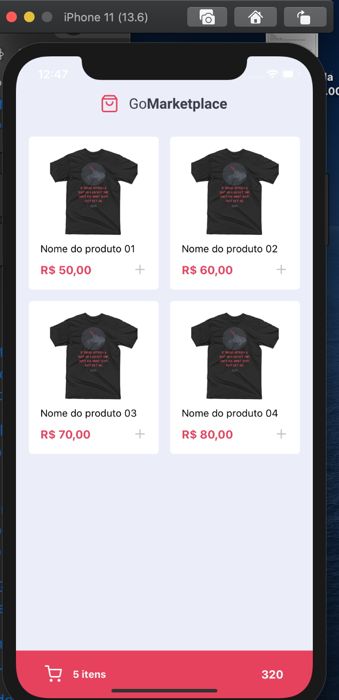
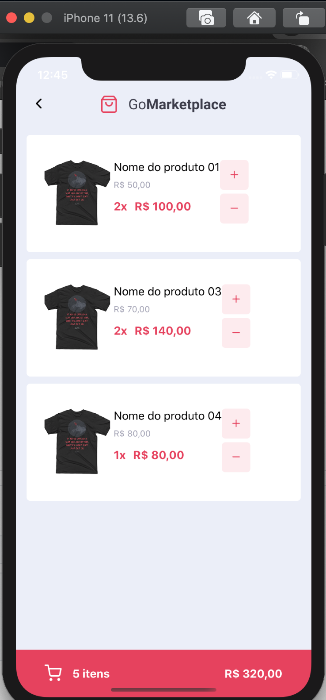

<h1> Sobre o projeto: </h1>

 O GoMarketplace é um software desenvolvido no âmbito acadêmico, onde o usuário consegue selecionar pedidos no aplicativo e  prosseguir para o carrinho de compras, onde é possível ver o total de pedidos e o valor a ser pago. Esse projeto é referente ao desafio 08 do bootcamp da rocketseat e tem como objetivo nos fazer praticar fundamentos de React-Native. 

<h2> Telas: </h2>

    

<h2> Tecnologias utilizadas: </h2>

Muitas ferramentas foram utilizadas para o desenvolvimento desse projeto, entre elas...

<ul>
  <li>React-native</li>
  <li>Styled-components</li>
  <li>Axios</li>
  <li>Eslint</li>
  <li>Prettier</li>
  <li>JSON Server</li>
 </ul>
 
 
 <h2> Ambiente de Desenvolvimento: </h2>
 
 
Para rodar esse projeto, é necessário o NodeJS instalado em sua máquina. 

 
 <code> git clone https://github.com/antoniovuono/GoMarketplace </code>
 
 <h2> API utilizada no projeto:</h2>
 
 <h3> Para rodar esse projeto vamos utilizar uma FakeAPI, basta rodar esse comando no terminal: </h3>
 
 <code> yarn json-server server.json -p 3333 </code>
 
 <h2> Instalação do projeto: </h2>
 
 Instale o yarn na pasta raiza do projeto para instalar as bibliotecas do projeto. 

 <code> yarn  </code>
 <h3>Rodar no IOS:</h3>
 <code> yarn ios </code>
 <h3>Rodar no Andoird:</h3>
 <code> yarn android </code>
 
